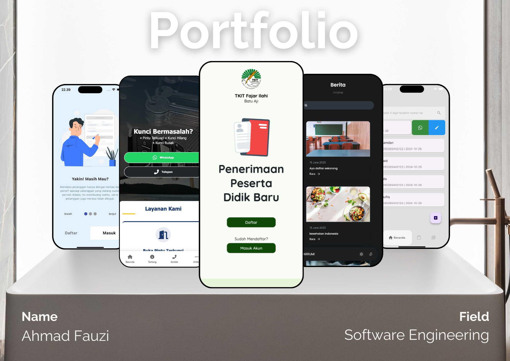

  
  <h1 style="margin-bottom: 5px;">Hi there, I'm Ahmad Fauzi!</h1>

  

  

<table align="center" style="border-collapse: collapse; border: none; width: 100%;">
  <tr style="border: none;">
    <td width="60%" style="border: none; padding-right: 20px; vertical-align: top;">
      <h3 style="margin-top: 0;">👨‍💻 About Me</h3>
      

        I possess 2 years of comprehensive web development expertise, encompassing the creation of intuitive and responsive UI/UX. I am eager to contribute positively and continuously learn. I particularly value teamwork and excel at building impactful solutions through shared vision and meticulous planning.
      

      
📫 <strong>Reach me out:</strong>

      

        
        
      

    </td>
    <td width="40%" align="center" style="border: none; vertical-align: top;">
      
    </td>
  </tr>
</table>

  

  <h3>🚀 Tech Stack & Tools</h3>
  
  

    <i>Responsive Web Design • Mobile App Development • UI/UX Design • SOLID Principles • CCNA</i>
  

 
 

<h3 style="margin-bottom: 15px;">💼 Experience</h3>

  <strong style="font-size: 1.1em;">Freelance Web Developer</strong> | <i>Self-Employed</i> <code>(2024 - Present)</code>
  <ul style="margin-top: 8px;">
    <li style="margin-bottom: 5px;">Designed and developed <strong>jasaahlikunci.com</strong>, a web-based company profile for a key duplication service in Batam.</li>
    <li style="margin-bottom: 5px;">Implemented SEM and SEO strategies to improve site visibility and local search rankings.</li>
    <li>Built a responsive and user-friendly interface using modern web technologies to enhance customer conversion.</li>
  </ul>

  <strong style="font-size: 1.1em;">Junior Software Engineer</strong> | <i>CV Mitra Total Solution</i> <code>(2022 - 2023)</code>
  <ul style="margin-top: 8px;">
    <li style="margin-bottom: 5px;">Developed and optimized the Web UI for <strong>PPDB Al Kahfi</strong>, ensuring a seamless registration flow for users.</li>
    <li style="margin-bottom: 5px;">Designed and implemented the Android UI for <strong>Hang Mobile</strong>, focusing on intuitive navigation and responsive layouts.</li>
    <li style="margin-bottom: 5px;">Collaborated on the <strong>Mid Wiyata</strong> project, delivering high-fidelity Web UI/UX designs that met specific client requirements.</li>
    <li>Worked within a cross-functional team to translate complex requirements into functional code and elegant user interfaces.</li>
  </ul>

 
 

<table align="center" style="border-collapse: collapse; border: none; width: 100%;">
  <tr style="border: none;">
    <td width="50%" valign="top" style="border: none; padding-right: 15px;">
      <h3 style="margin-bottom: 15px;">🎓 Education</h3>
      <ul style="padding-left: 20px;">
        <li style="margin-bottom: 15px;">
          <strong>Universitas Putera Batam</strong> 
          B.S. in Information Systems (Candidate) 
          <i>GPA: 3.64/4.00 | Expected: 2027</i>
        </li>
        <li>
          <strong>SMKN 7 Batam</strong> 
          Vocational Diploma in Software Engineering 
          <i>Jul 2020 - Apr 2023</i>
        </li>
      </ul>
    </td>
    <td width="50%" valign="top" style="border: none;">
      <h3 style="margin-bottom: 15px;">🏅 Certifications</h3>
      <ul style="padding-left: 20px;">
        <li style="margin-bottom: 8px;">CCNA: Switching, Routing, and Wireless Essentials (2026)</li>
        <li style="margin-bottom: 8px;">Python Programming Essentials with Gen Al Tools (2025)</li>
        <li style="margin-bottom: 8px;">SOLID Programming Principles (2024)</li>
        <li style="margin-bottom: 8px;">Flutter Application Development (2024)</li>
        <li>React Development: Building High-Performance UIs (2024)</li>
      </ul>
    </td>
  </tr>
</table>

 
 

<h3 style="margin-bottom: 10px;">🌟 Volunteer & Leadership</h3>

<strong>Yayasan Duta Inspirasi Indonesia</strong> <code>(Mar - Jun 2024)</code>

<blockquote style="border-left: 4px solid #2196F3; padding-left: 15px; color: #555; font-style: italic;">
  Had the opportunity to become a "Duta Inspirasi Indonesia batch 12" through national level selection to inspire and contribute to supporting Indonesia Emas 2045. Managed the development of social media content for the batch 12 inspiration ambassador.
</blockquote>

 
 

  <h3 style="margin-bottom: 20px;">📊 GitHub Analytics</h3>
  
  

